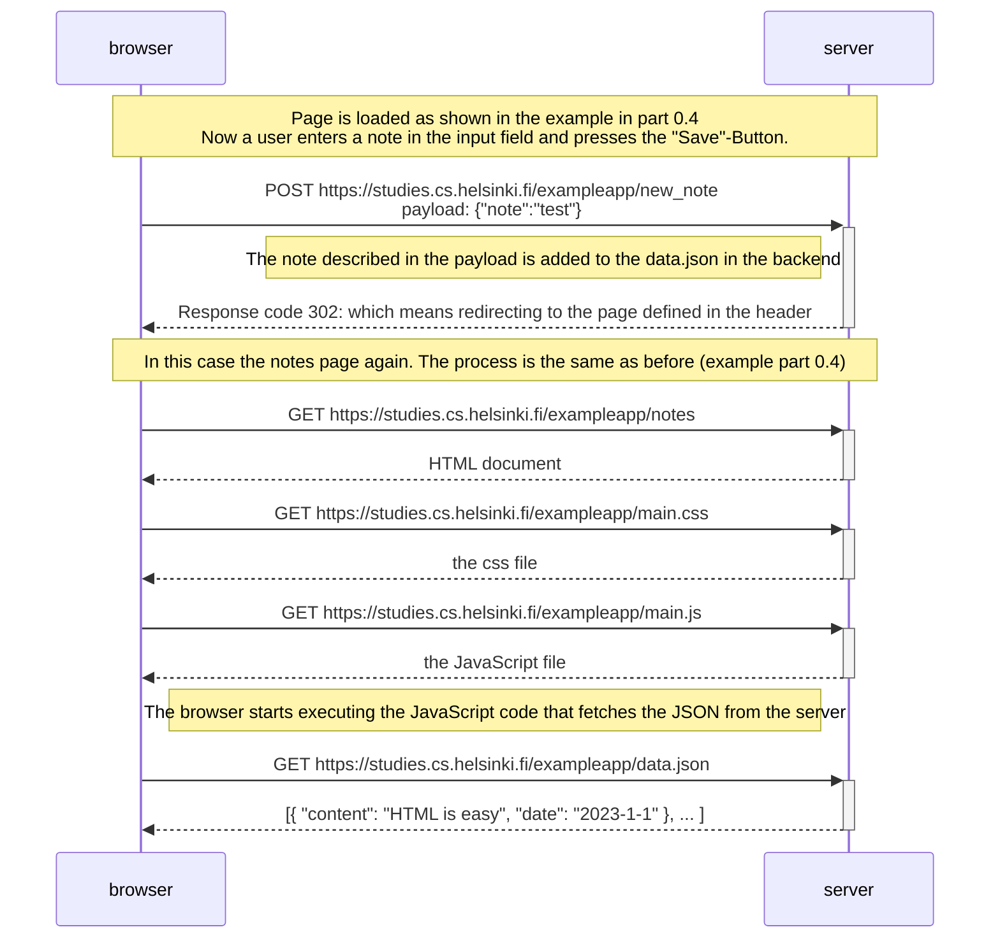

Here you can find the sequence diagram for the first example:

```mermaid
sequenceDiagram
    participant browser
    participant server

    Note over server,browser: Page is loaded as shown in the example in part 0.4 <br>Now a user enters a note in the input field and presses the "Save"-Button.

    browser->>+server: POST https://studies.cs.helsinki.fi/exampleapp/new_note <br> payload: {"note":"test"}
    Note left of server: The note described in the payload is added to the data.json in the backend
    server-->>-browser: Response code 302: which means redirecting to the page defined in the header

    Note over browser,server: In this case the notes page again. The process is the same as before (example part 0.4)

    browser->>+server: GET https://studies.cs.helsinki.fi/exampleapp/notes
    server-->>-browser: HTML document

    browser->>+server: GET https://studies.cs.helsinki.fi/exampleapp/main.css
    server-->>-browser: the css file

    browser->>+server: GET https://studies.cs.helsinki.fi/exampleapp/main.js
    server-->>-browser: the JavaScript file

    Note right of browser: The browser starts executing the JavaScript code that fetches the JSON from the server

    browser->>+server: GET https://studies.cs.helsinki.fi/exampleapp/data.json
    server-->>-browser: [{ "content": "HTML is easy", "date": "2023-1-1" }, ... ]
```
