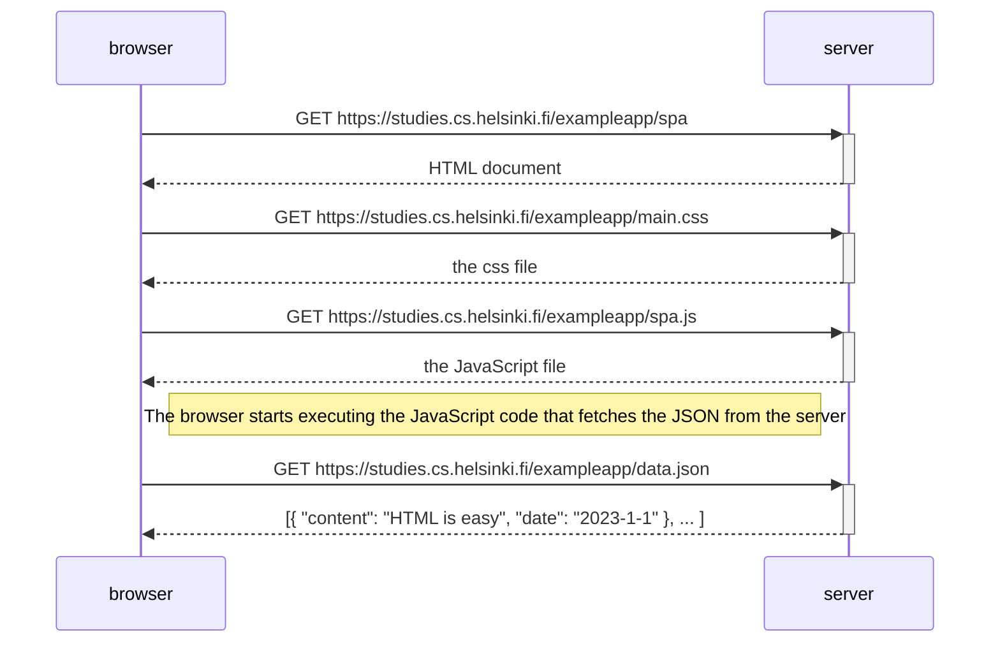

# Part 0.5

In this readme there is the way described how the SPA site gets requested.
The process just differs a little: by different files are requested.

```mermaid
sequenceDiagram
participant browser
participant server

    browser->>+server: GET https://studies.cs.helsinki.fi/exampleapp/spa
    server-->>-browser: HTML document

    browser->>+server: GET https://studies.cs.helsinki.fi/exampleapp/main.css
    server-->>-browser: the css file

    browser->>+server: GET https://studies.cs.helsinki.fi/exampleapp/spa.js
    server-->>-browser: the JavaScript file

    Note right of browser: The browser starts executing the JavaScript code that fetches the JSON from the server

    browser->>+server: GET https://studies.cs.helsinki.fi/exampleapp/data.json
    server-->>-browser: [{ "content": "HTML is easy", "date": "2023-1-1" }, ... ]

```
