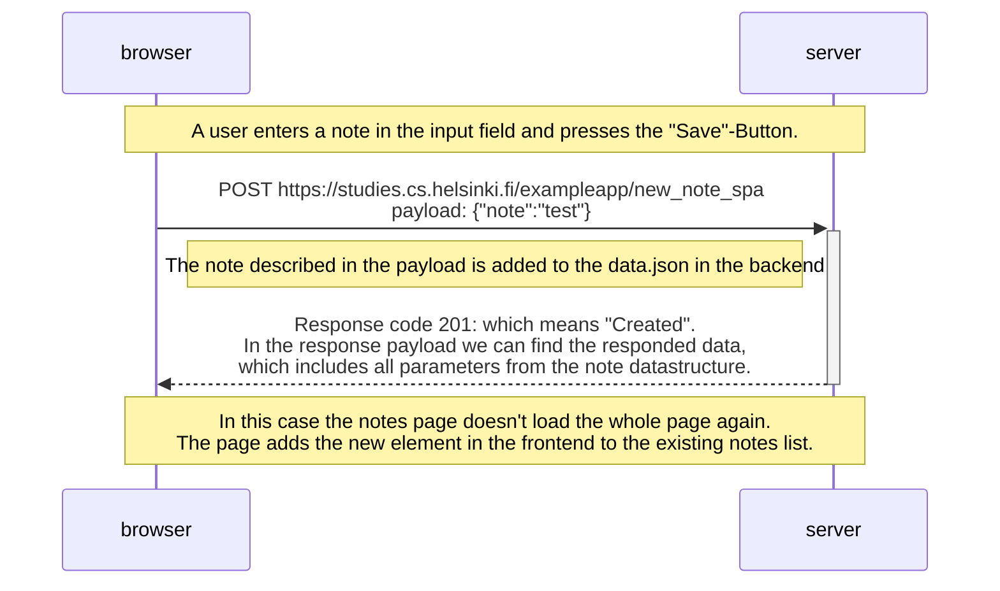

# Part 0.6

In this readme there is the way described how the SPA adds a new note to the existing list.

```mermaid
sequenceDiagram
    participant browser
    participant server

    Note over server,browser: A user enters a note in the input field and presses the "Save"-Button.

    browser->>+server: POST https://studies.cs.helsinki.fi/exampleapp/new_note_spa <br> payload: {"note":"test"}
    Note left of server: The note described in the payload is added to the data.json in the backend
    server-->>-browser: Response code 201: which means "Created". <br>In the response payload we can find the responded data,<br> which includes all parameters from the note datastructure.

    Note over browser,server: In this case the notes page doesn't load the whole page again. <br>The page adds the new element in the frontend to the existing notes list.

```
